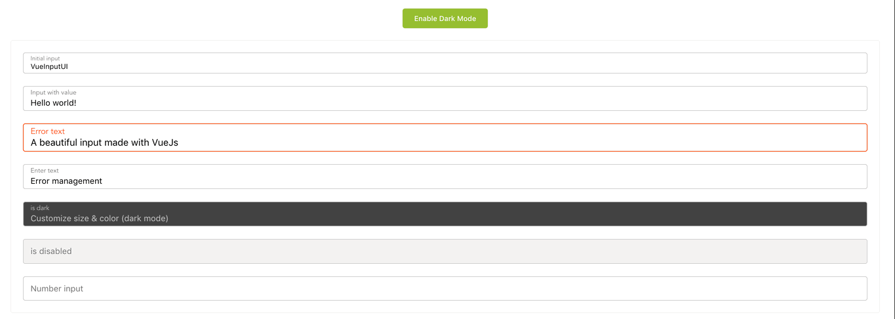

# vue-input-ui

> A beautiful input made with Vue JS



## Demo

[Enjoy](https://louismazel.github.io/vue-input-ui/)

## Installation

### Using yarn

`yarn add vue-input-ui`

### Using npm

`npm i --save vue-input-ui`

## Usage

### ES6 Modules / CommonJS

```js
import VueInputUi from 'vue-input-ui';
import 'vue-input-ui/dist/vue-input-ui.css';

Vue.component('vue-input-ui', VueInputUi);
```

```html
<VueInputUi v-model="yourValue" />
```

### UMD

```html
<VueInputUi v-model="yourValue" />

<script src="https://unpkg.com/vue" charset="utf-8"></script>
<script src="./dist/vue-input-ui.umd.min.js" charset="utf-8"></script>
<link rel="stylesheet" type="text/css" href="./dist/vue-input-ui.css">

<script type="text/javascript">
  Vue.component('vue-input-ui', window.VueInputUi.default);
</script>
```

## Props API

| Props      | Type       | Required | Default    | Options        |
|------------|------------|----------|------------|----------------|
| v-model    | String/Int | true     | -          | -              |
| id      | String     | false    | VueInputUi | -              |
| label      | String     | false    | Enter Text | -              |
| type       | String     | no       | text       | [text|number|textarea] |
| size | String `sm or lg`    | no       | false      |                |
| color | String `HEX`   | no       | dogderblue      |                |
| hint*       | String       | no       | -          |                |
| error** | Boolean    | no       | false      |                |
| dark | Boolean    | no       | false      |                |
| dark-color (4)                   | String (hex)      | no       | #424242  |
| disabled | Boolean    | no       | false      |                |
| required | Boolean    | no       | false      |                |
| readonly | Boolean    | no       | false      |                |
| clearable | Boolean    | no       | false      |                |
| loader | Boolean    | no       | false      |                |
| border-radius                   | Number           | no       | 4 |

## Contribution

### Project setup

```bash
npm install
```

### Compiles and hot-reloads for development

```bash
npm run serve
```

### Lints and fixes files

```bash
npm run lint
```

## License

This project is licensed under [MIT License](http://en.wikipedia.org/wiki/MIT_License)
